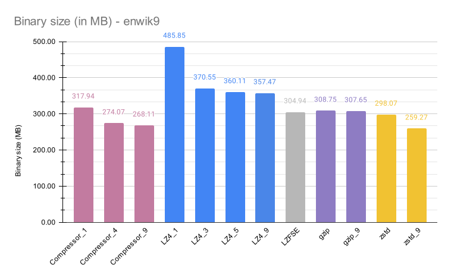
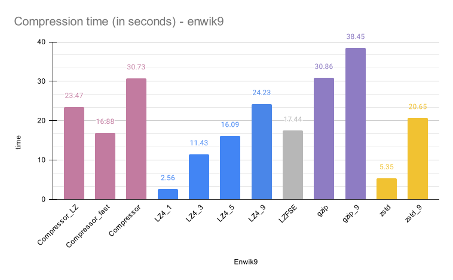
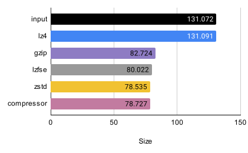
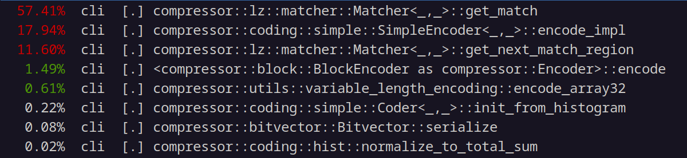
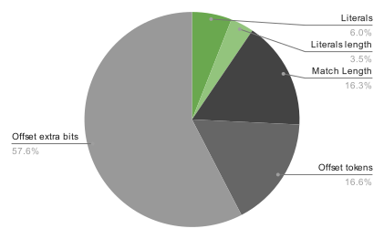
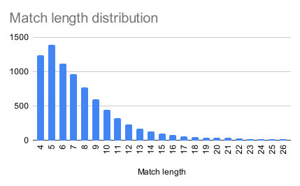
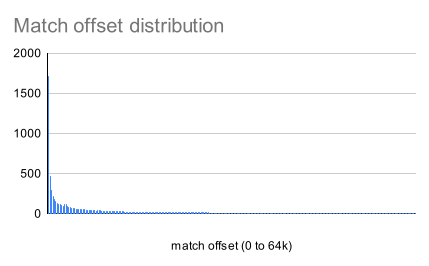

# Compressor

Compressor is an implementation of a modern compressor that uses LZ matching and
entropy coding (fse). The compressor is able to achieve compression rates that
are similar to gzip, zstandard and lzfse. The compressor is written in rust
without external dependencies and should be readable.


# Command line tool

The compressor comes with a command line tool that can compress and decompress files. To enable detailed logging set the environment variable RUST_LOG=info. 

```txt
$ cli ./data/bench/dickens -o /tmp/dickens.rz
[INFO  cli] Compressing using the Full compressor
[INFO  cli] Compressed from 10192446 to 3828772 bytes.
[INFO  cli] Compression ratio is 2.6621x.
[INFO  cli] Wrote /tmp/dickens.rz.
[INFO  cli] Operation completed in 6.5786204 seconds
```

# Benchmark

The following charts show how the new compressor compares against other
compressors. The different programs are evaluated on the enwik9 benchmark, from
the [Large Text Compression Benchmark](https://mattmahoney.net/dc/text.html).
The size of the original file is 1000000000 bytes. The programs ran on Intel
i9-9900 on Ubuntu 23.04. Some programs are included multiple times with
different compression levels. Lzfse was built from source with gcc-12.3, and
zstd, lz4 and gzip came from the Ubuntu distribution. Compressor was built with
Rust 1.73.

This chart compares the size of the compressed binary:



This chart compares the execution time of the compressors:



The compressors in the benchmark are operating in two parts: matching and
entropy encoding. This benchmark zooms in on the entropy encoding part of the
compression.  This [tool](scripts/gen_sharp_input.py) is generating inputs
without repetitions but with a non-uniform distribution of symbols. The results
demonstrate that the entropy encoding of the compressor is effective, and
that modern FSE techniques outperform gaip's Huffman coding.



The compressor spends around 70% of the time in the matching phase, and 20% of
the time in the entropy coding phase.



This chart shows the breakdown of bytes inside the binary. The green slices are
the literals and literal lengths, and the gray slices show the upper and lower
parts of offsets, and the length of the offsets. All of the slices are listed
after entropy encoding, as they lay in the file.


The charts below show the match length and offset distributions. The match
length distribution uses regular values. The match offset chart shows numbers in
the range zero to 65536, and are placed in 256 buckets of 256 elements.

 
