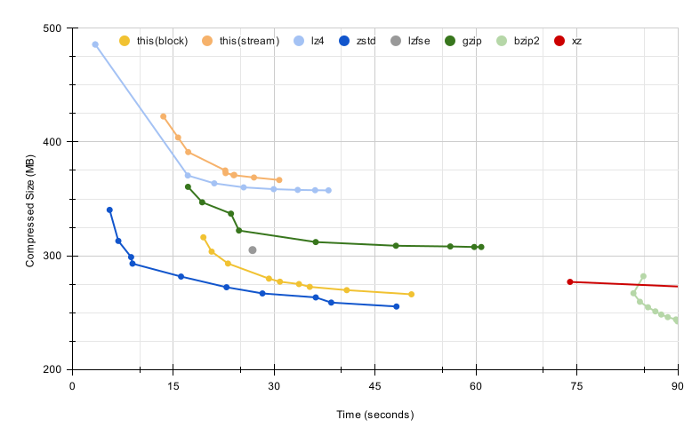

# Compressor

**Compressor** is an educational implementation of a modern lossless compressor.
The compressor itself is fast and effective, and in fact can outperform gzip in
both compression size and speed. But the code is minimal and easy to follow.
The compressor uses modern LZ matching techniques and entropy coding. The
compressor is written in safe rust without external dependencies. The code is
written in a clear way for educational purposes.

The matcher in this project has a look-ahead parser, and uses a
multi-way cache. The Finite State Entropy encoder is similar to the encoders
used by zstd and lzfse.

The technical details are [explained here](docs/details.md).

## Benchmark

The chart below compares this compressor with several other compressors.
Each dot in the curve represents a compression level (1 through 9). T
The different programs are evaluated on the enwik9 benchmark, from
the [Large Text Compression Benchmark](https://mattmahoney.net/dc/text.html).

The size of the original file is 1,000,000,000 bytes. Smaller size and lower
compression time is better.  The programs ran on an Intel i9-9900 on Ubuntu
23.04. The benchmark script is located in the `script` directory.  Lzfse was built
from source with gcc-12.3, and zstd, lz4 and gzip and bzip2 came from the Ubuntu
distribution. Compressor was built with Rust 1.73.




## Command line tool

The compressor comes with a command line tool that can compress and decompress
files. To enable detailed logging set the environment variable `RUST_LOG=info`.

```txt
$ cli ./data/bench/dickens -o /tmp/dickens.rz
[INFO  cli] Compressing using the Full compressor
[INFO  cli] Compressed from 10192446 to 3828772 bytes.
[INFO  cli] Compression ratio is 2.6621x.
[INFO  cli] Wrote /tmp/dickens.rz.
[INFO  cli] Operation completed in 6.5786204 seconds
```

## Interesting facts

This chart shows the trade-off between compression time and the size of the
binary. The graph was generated by enumerating various parameters, such as
window size, bank size, and parse length. Points that are dominated by other
points were removed. Dominated points are points that are worse on both
dimensions and are not optimal. The remaining points create the Pareto curve
from which we select a number of compression level configurations.


The compressors in the benchmark are operating in two parts: matching and
entropy encoding. This benchmark zooms in on the entropy encoding part of the
compression.  This [tool](scripts/gen_sharp_input.py) is generating inputs
without repetitions but with a non-uniform distribution of symbols. The results
demonstrate that the entropy encoding of the compressor is effective, and that
modern entropy encoding techniques outperform gzip's Huffman coding.


In high compression levels, the compressor spends around 70% of the time in the
matching phase, and 20% of the time in the entropy coding phase.


This chart shows the size breakdown of the compressed binary. The green slices
represent the literals and literal lengths, and the gray slices represent the
match-offsets and the match-lengths. The match-offsets section is split into
two streams: entropy-encoded tokens, and extra bits which are not entropy
encoded.


The charts below show the match length and offset distributions. The match
length distribution uses regular values. The match offset chart shows numbers in
the range zero to 65536, and are placed in 256 buckets of 256 elements.

 
