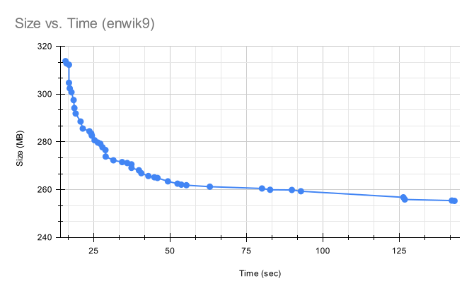

# Technical details

This page describes the techniques and the design decisions made in this project.

# Overall structure

The compressor has a few components that are described in detail below. This
section describes the data-compression pipeline and how the pieces fit together.

### The compression pipeline
The input is split into large chunks that are compressed independently. The
maximum size of each chunk is 4GB, to allow the use of 32bit indices within each
chunk. Each chunk is wrapped with a header that includes a length a magic
signature. Individual transformations can further split chunks into smaller
chunks.

The first phase of compression is matching. The matcher is responsible for
splitting the input stream into a sequence of packets that describe a region of
literals, followed by a reference to a sequence of bytes from earlier in the
file. Every packet returns the two sequences (literal region and match region),
and either regions can be empty. The compressor can encode the match sequence
into LZ4 encoding. This was implemented to allow a comparison to the LZ4
matcher.

After the matcher extracts the match regions, the sequence of match and literal
regions are decomposed into four streams:

1. Literals (a sequence of bytes as they appear in the input file).
2. The length of the literal segment.
3. The offset to the match.
4. The length of the match region.

The four streams are handled in different ways. The literal region, and the two
length buffers are each compressed independently with the entropy encoder. The
buffer that holds the offsets, which is also the biggest of the four buffers, is
handled separately. The offset buffer is first transformed to reduce the cost of
repetitive offsets. The offsets are shifted to free the range zero to three. The
values zero to three represent offset values that have appeared in the last
three places in the stream. Repetitive offsets often show up in structured data.
We don’t increase this value further because the probability of repetitive
offsets drops very quickly, and increasing the length of offsets can be costly.

After transforming the offset stream, the stream is split into two buffers:
extra-bits, and bit-length. The extra-bits buffer holds the raw bits of the
offsets, while the other stream holds a byte that specifies the number of bits
that were saved into the bit-stream. This is an effective form of compression
because the distribution of offset lengths is very sharp and most offsets
requite few bits to encode. The second buffer of 8-bit values that represent the
length of the numbers in the extra-bit section are now compressed using entropy
encoding. Entropy encoding is effective because of the sharp histogram in the
offset-length values. Notice that we don’t save the upper bit of the binary
number in the extra-bits buffer, because it always has to be equal to one,
otherwise we would have made the number shorter.

| Stream      | Compression method |
| ----------- | ----------- |
| Literals        | Entropy encoded (0..255) |
| Literal Lengths | Entropy encoded (0..255) |
| Match Lengths   | Entropy encoded (0..255) |
| Offset Length   | Extra-bit stream, entropy encoded tokens (0..24) |

Finally the four streams are concatenated together. It is possible to accelerate
the encoding and decoding stream by interleaving the encoding of regions into
multiple parallel streams but this is not currently implemented.

### Compression levels

There are different parameters in the compressor that control the performance of
the compressor and the trade-off between compression time and the size of the
output. Some of the parameters are:

* The number of entries in the matcher cache.
* The number of ways in the matcher cache.
* The parser look-ahead value.
* The matcher search window.

The compression levels (1 to 9) need to represent a trade-off between
compression speed and the size of the compressed binary. Finding the
configuration for each one of the levels is done by enumerating all of the
possibilities and eliminating the points that are dominated by other points.  A
point dominates other point if it has both compression time and compression size
values.

This chart shows the dominating points from which we can select the compression levels.

# Matcher

The matcher is responsible for iterating over the input and return a sequence of
pairs: literal region and match region. The matcher is implemented as an
iterator that allows the compressor to process the matches one at a time, and
work on the input in chunks. The matcher has two parts: the dictionary or cache
that finds the matches, and the parser that selects the matches. The project has
two parsers. A traditional look-ahead parser and an optimal parser.

## The dictionary

Both of the matchers rely on an underlying cache data structure that finds
common sequences of bytes. The dictionary is built as a multi-way cache. The
size of the cache and the number of ways is configured according to the
compression level. On every byte the matcher reads the four consecutive bytes
and creates a hash value that determines where in the cache the index of the
byte will be stored. The ways in the LRU cache are rotated on each write.

To find matches from earlier in the file the matcher fetches 4 bytes and finds
the entry in the cache. If there are no cache collisions then each of the items
in the way represent a match from earlier in the file. The matches are sorted by
the distance from the current index. This allows the search procedure to stop
early if we only allow distances of certain length. After a match is searched
the index of the current location can be saved to the cache, as described above.

There are a few tricks that can speed up the match speed. First, after a first
match is found it is possible to quickly disqualify future matches. If a match
of length X is found, the cache module starts looking at index X+1, to quickly
disqualify the match, instead of scanning from the first byte of the match
string.

## Look-ahead Parser

The parser is responsible for selecting the best match from several possible
candidates, while minimizing compression time and reducing the output size.
Selecting a specific match may preclude the possibility of selecting a longer
match that may start one or two bytes later. It's not practical to scan all
possible combinations so the parser needs to rely on heuristics and skip some
combinations.

Our parser uses a look-ahead feature that compares the current match to the next
few matches that start at the following bytes. The number of bytes to look ahead
depends on the compression level. To select the best match the parser calculates
the cost of the literals that will be emitted if a further match will be
selected, the location of the end of the match, and the offset to the match
destination (longer matches take more bytes to encode).

It's difficult to create an accurate cost model because the cost of the offset
field and the literal sequence after the entropy encoder depends on decisions
before and after the current match.

## Optimal Parser

The optimal parser attempts to generate the best possible sequence of matches,
considering the limitations of inaccurate cost model. The optimal parser scans
the input and generates the list of all possible matches. Next, it scans the
list of matches backwards and calculates the best possible distance and path for
each byte in the input stream. The dynamic programming algorithm makes the match
selection an O(n) algorithm, but the main cost of the scan is the search for
matches for each byte in the stream. It is possible to improve the performance
of the optimal parser by splitting the input into segments with little loss of
correctness, but this feature is still not implemented. The optimal parser is
not always better than the traditional look-ahead parser because of cost-model
limitations.

# Encoder

This compressor features a table-based Asymmetric Numeral System (tANS), similar
to the implementation found in zstd and lzfse.
Andrew Polar [wrote](http://www.ezcodesample.com/abs/abs_article.html) an
excellent introduction to ANS. The implementation in this project is inspired
by the excellent [blog series](http://cbloomrants.blogspot.com/2014/01/1-30-14-understanding-ans-1.html)
by Charles Bloom.  It is simple and does not have all of the code optimizations
that FSE has that makes the code very fast but less readable. The code is not
The compression ratio of this implementation is similar to the compression ratio
of FSE. In this section describes the specific implementation details and not
how ANS works.

To encode a buffer the encoder scans the input buffer and creates a normalizes
histogram, where the total number of elements in the histograms is equal to the
number of states. The histogram is also the key to decoding the message and is
transmitted together with the encoded message.
We use Yann's
[method](http://fastcompression.blogspot.com/2014/02/fse-distributing-symbol-values.html)
method to spread the symbols in the state list. The encoder and decoder
use the state list to create the encoding and decoding tables.

The histogram is a table that assigns a value to each letter in the alphabet.
Our configuration contains 4096 states, so the normalized histogram often
contains values that are greater than 255. We serialize the histogram by
encoding symbol values over 255 with a sequence of 255-byes that are accumulated
into the final value. This is also the method that LZ4 uses to encode lengths.
It's very effective because there are usually few values above 256.

The encoder is used to compress the literal stream, the match and literal
lengths, and the tokens that represent the offset bit-width. The token-list and
the literal stream use two different configurations. We limit the length of the
offset to 24-bits, which allows us to compress the token list using 24 symbols.
The length buffers and the literal buffer use an alphabet that has 256 symbols.
The length buffers have values that are greater than 255 and are encoded using
following bytes as described above.

The buffer that contains all of the literals is split into small chunks
(typically 64k). Splitting the regions into smaller sections allow the entropy
encoder to have sharper histograms.  This happens when two different parts of
the file have a different distribution of values.

